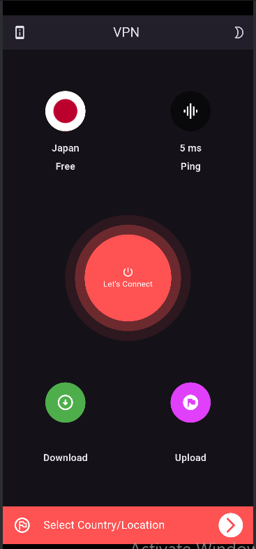
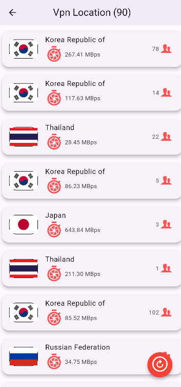
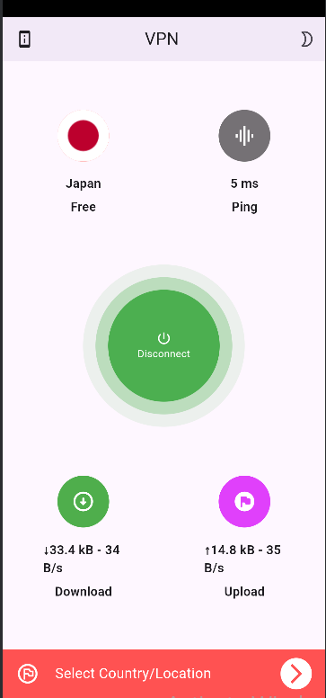

# 🌐 Free VPN - Flutter App

A secure and simple Free VPN mobile application built using the Flutter framework. This app allows users to browse the internet safely by connecting to free VPN servers.

## 🚀 Features

- 🔒 Connect to free VPN servers
- 🌍 View and select from available countries
- 📱 native integrations with android
- 🧪 Smooth and clean user interface
- ⚡ Built using Flutter and Dart

## 🛠️ Tech Stack

- **Flutter** – UI Framework
- **Dart** – Programming Language
- **VPN APIs** – VPN connections
- **getX** – State Management 
- **HTTP** – for API requests

## 📸 Screenshots

  

